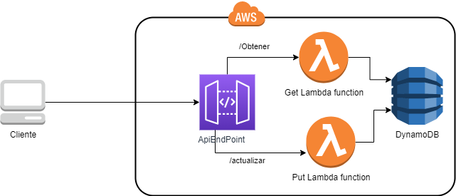

# Actualizacion Datos
Con esta aplicación actualiza tus datos de forma muy fácil. Esta basada en arquitectura serverless, esto quiere decir que los recursos no necesitan tu administración, se crean y se destruyen en minutos cuando tu quieras y pagas solamente por lo que utilizas.

## Pre-requisitos
- Cuenta de AWS creada
- AWS CLI instalado en tu equipo `https://docs.aws.amazon.com/cli/latest/userguide/getting-started-install.html`
- Tener configurada las credenciales con el comando`aws configure` sigue los pasos `https://docs.aws.amazon.com/cli/latest/userguide/cli-configure-quickstart.html`
- SAM CLI instalado en tu equipo `https://docs.aws.amazon.com/serverless-application-model/latest/developerguide/install-sam-cli.html`
- NodeJs `https://nodejs.org/en/`

## Desplegar el backend en AWS
- `SAM build`  
- `SAM deploy --guided`

## Eliminar la aplicación y los recursos
- Ejecuta `aws s3 rm s3://<nombre bucket> --recursive`
- Ejecuta `SAM delete --stack-name actualiza-datos`
