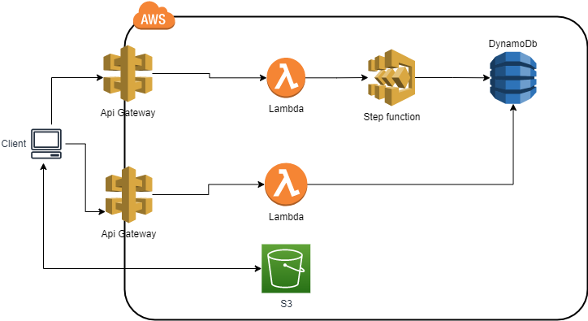

# Eccomerce backend
Con esta aplicación se controla el inventario de una tienda online  Esta basada en arquitectura serverless, se utilizan servicios como step functions, lambdas, api gategay, dynamodb, simple email services.

## Pre-requisitos
- Cuenta de AWS creada
- AWS CLI instalado en tu equipo `https://docs.aws.amazon.com/cli/latest/userguide/getting-started-install.html`
- Tener configurada las credenciales con el comando`aws configure` sigue los pasos `https://docs.aws.amazon.com/cli/latest/userguide/cli-configure-quickstart.html`
- SAM CLI instalado en tu equipo `https://docs.aws.amazon.com/serverless-application-model/latest/developerguide/install-sam-cli.html`
- NodeJs `https://nodejs.org/en/`

## Desplegar el backend en AWS
- `SAM build`  
- `SAM deploy --guided`

## Eliminar la aplicación y los recursos
- Ejecuta `aws s3 rm s3://<nombre bucket> --recursive`
- Ejecuta `SAM delete --stack-name e-commerce`

## Desarrollador
-  sahily.exe@gmail.com